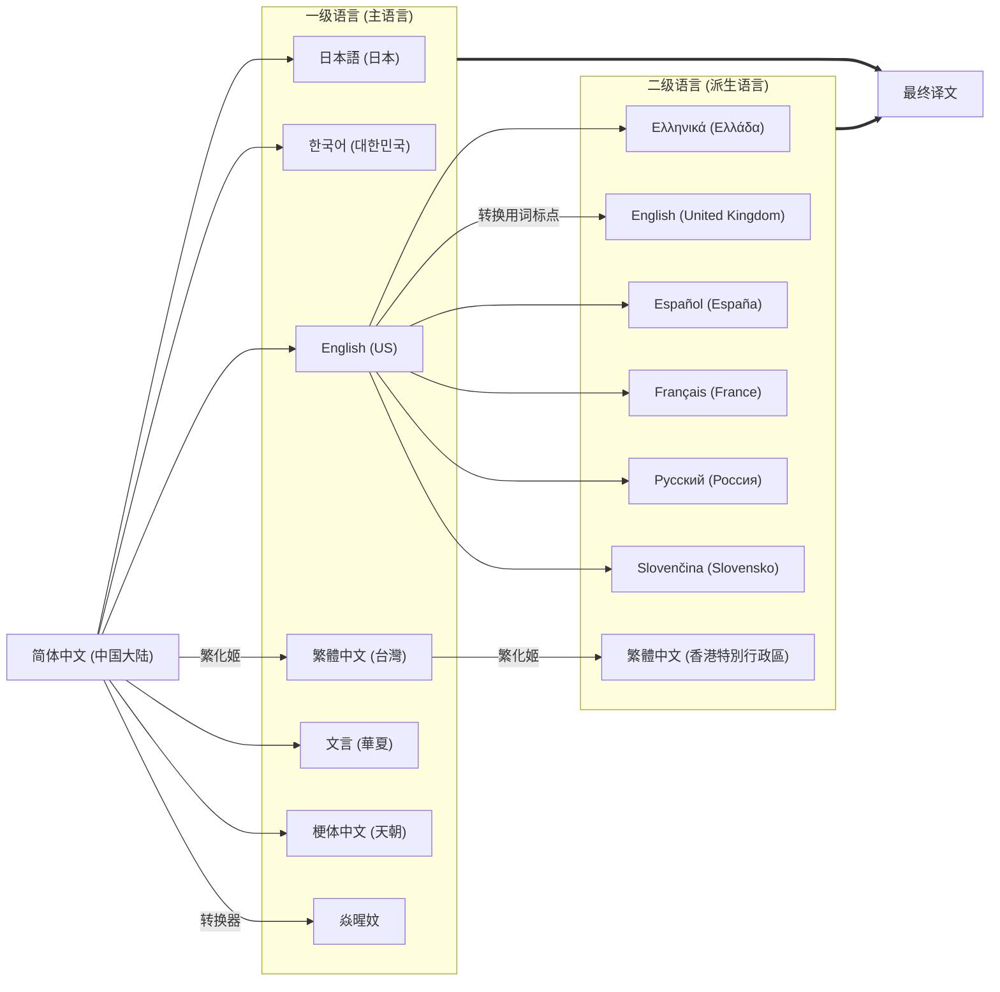
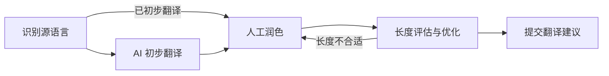
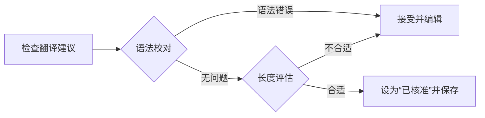
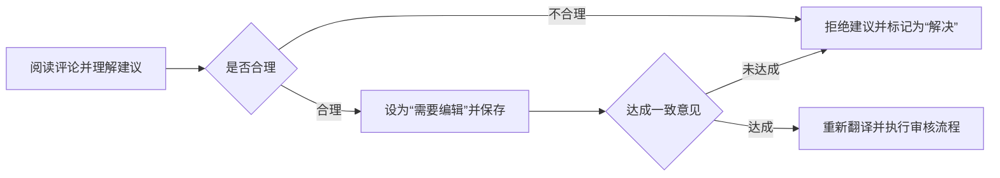
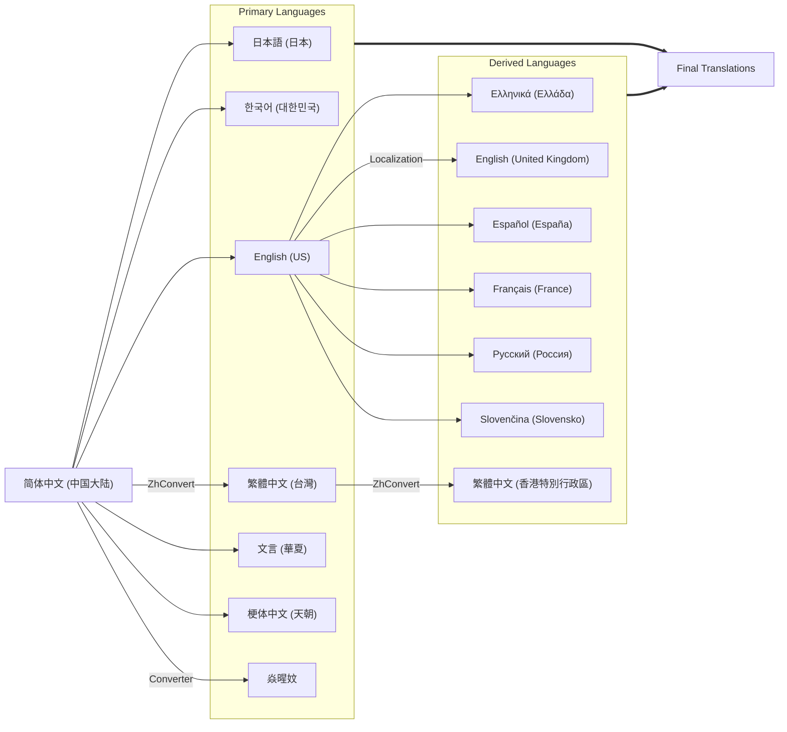
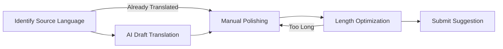
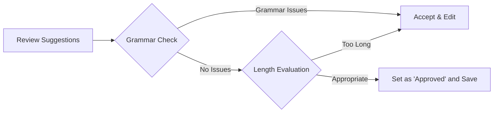
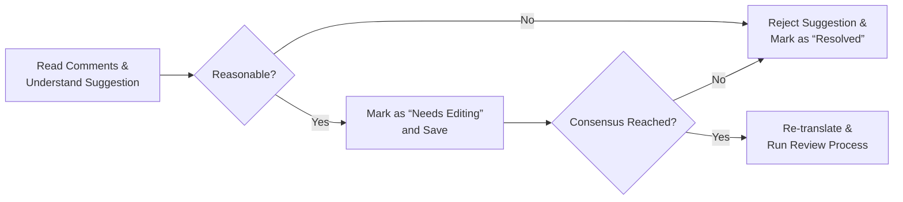

# PCL i18n & l10n 项目指南

[*Scroll down for the English version!!!*](#pcl-i18n--l10n-project-guide)

本文档旨在帮助您快速了解 **PCL i18n 项目** 的工作流程，并指出翻译过程中常见的问题，以便更高效、准确地参与贡献。无论您是初次接触翻译项目的新手，还是经验丰富的翻译人员，本指南都将为您提供清晰的操作步骤和实用的建议。通过遵循本文档中的流程，您可以确保翻译内容的质量与一致性，同时避免常见的错误和误解。希望本指南能成为您参与 PCL i18n 项目时的得力助手！

## 整体翻译工作流程

为确保翻译质量和流程效率，我们制定了如下翻译流程，兼顾准确性、适配性、一致性及精炼性。考虑到从中文直接翻译为某些语言 (如西欧语言) 可能会造成文本冗长、结构不佳等问题，我们优先将其翻译为英文，优化表达后再作为其他语言的基础版本。

因此在翻译过程中，务必了解并遵循既定的流程，以避免产生不规范的操作。例如：不应在 English (United Kingdom) 中提交与 English (US) 完全不一样的译名；不得直接使用中文译名进行派生语言翻译；也不可仅依赖基础的简繁转换工具进行语言转换。

流程如下：

### 1. 上游仓库更新与语言文件准备

当项目主仓库 ([tangge233/PCL2/tree/Language](https://github.com/tangge233/PCL2/tree/Language)) 更新后，我们将进行以下操作：

- 同步更新内容；
- 解决冲突；
- 为所有语言文件添加新的默认中文字符串。

### 2. 第一级翻译：中文 → 主语言

新添加或更新的中文字符串首先被推送至 Weblate 平台，进行第一轮翻译。目标语言包括：

- English (US)
- 日本語 (日本)
- 한국어 (대한민국)
- 文言 (華夏)
- 繁體中文 (台灣) - 使用 [繁化姬](https://zhconvert.org/) 转换并人工校对
- 梗体中文 (天朝)
- 焱暒妏 - 使用自动转换器处理

### 3. 第二级翻译：主语言 → 派生语言

一级语言完成后，将其内容作为基础，进行派生语言的翻译。对应关系如下：

- 基于 `English (US)`：
  - Ελληνικά (Ελλάδα)
  - English (United Kingdom) - 调整词汇与标点风格
  - Español (España)
  - Français (France)
  - Русский (Россия)
  - Slovenčina (Slovensko)

- 基于 `繁體中文 (台灣)`：
  - 繁體中文 (香港特別行政區) - 使用 [繁化姬](https://zhconvert.org/) 并人工校对

### 4. 翻译同步与提交

待所有一级和二级语言翻译完成后，我们将 Weblate 上的更改提交至仓库。

为了方便理解，我们还提供了清晰的流程图：



## 单字符串翻译流程

此前介绍的流程侧重于整体语言的翻译方式，未涵盖具体的字符串翻译方法。本节将详细说明如何逐步翻译和处理单个字符串，以提高翻译效率与质量。

### 一、提交翻译建议

适用于尚未翻译或尚未核准的字符串。

1. **识别源语言**：明确该字符串所属的源语言，并参考上一节“翻译工作流程”，确定其所依赖的上一级语言。

2. **初步翻译**：使用 AI 工具 (推荐 ChatGPT 系列) 或翻译器完成初步翻译，确保内容通顺、语义准确，同时提高效率。

3. **人工润色**：基于初步翻译对文本进行优化，确保与原文保持一致，避免意译过度或误解原意。

4. **长度评估与优化**：在 PCL 界面中查找该字符串，预估翻译后的**长度**是否适合界面显示。必要时简化表达、删减冗词。

5. **提交建议**：确认翻译无误后，提交翻译建议。



### 二、优化已翻译字符串

适用于已经核准但存在错误或可优化空间的字符串。

1. 按照“提交翻译建议”的方式提交更新后的翻译内容。

2. 发布评论以说明更改，评论类型选择 `译文评论，与其他翻译人员讨论`，格式如下：

   ```markdown
   **原译文错误**：<原内容>
   **纠正译文**：<新内容>
   **解释说明**：<修改原因和依据>
   ```

3. 保存评论后，等待管理员审核。建议同步在 QQ 群或 Discord 中发起讨论以加快响应。

### 三、审核翻译建议

适用于已被翻译但尚未被核准的字符串。

1. **核查建议内容**：逐条查看建议，确保语义清晰、语法准确、符合上下文。

2. **辅助工具校对**：可使用 AI 工具辅助检查语法和语言习惯。

3. **长度评估**：在 PCL 界面中确认译文长度合适，如有冗长可适当优化。

4. **执行核准**：将 `审校状态` 设置为 `已核准`，点击保存。



### 四、重新审核已核准内容

适用于已核准但出现错误或存在优化可能的字符串。

1. **查阅评论**：阅读其他贡献者提交的评论，理解问题描述，若有疑问可在原评论下进一步询问。

2. **判断合理性**：评估建议是否成立。如不成立，拒绝建议并说明理由，标记评论为 `解决`。

3. **需要修改时**：将 `审校状态` 设为 `需要编辑`，并保存，进入待修改状态。

4. **协商一致意见**：在评论区或交流群中征求其他译者意见，达成共识后，重新进行翻译并走“审核翻译建议”流程。如果未达成一致意见，则拒绝建议并标记为 `解决`。



## 特殊语言翻译

一些语言的翻译步骤与其他语言略有不同，以下是一些特殊语言的翻译说明：

### English (United Kingdom)

在将美式英语翻译为英式英语时，常规的翻译器或 AI 工具可能无法精准处理拼写与用词差异。因此，我们建议结合专业的拼写检查工具或转换器进行校对，以确保译文符合英式英语的规范。

推荐工具包括：

- **Grammarly**：[在线版](https://app.grammarly.com/) 或 [桌面版](https://www.grammarly.com/desktop)
- **Microsoft Editor** (Microsoft Edge 内置功能) 
- **GoTranscript** 的 [美式英语 ↔ 英式英语转换工具](https://gotranscript.com/translation-services/american-to-british)
- **Microsoft Word** 内置的拼写与语法检查功能

### 繁體中文 (台灣)

普通的翻译器、AI 工具或繁简转换器通常只能完成基础的字形替换，难以精准处理词汇和语义上的差异。例如：  

- `网络 → 網路`  
- `设置 → 設定`  
- `内存 → 記憶體`  

此外，由于汉字简化过程中多个字形被合并为一个字，导致在反向转换时往往无法准确判断应还原为何种繁体字，产生歧义。例如：  

- `髮、發 → 发`  
- `復、複、覆 → 复`  
- `臺、檯、颱 → 台`  

这若再辅以简单的查找替换，更可能出现啼笑皆非的误译 (~~比如“海記憶體知己”~~) 。

基于以上问题，我们选用了 **繁化姬** 作为标准转换工具。它不仅能将简体中文准确转换为繁体中文，还能覆盖大部分用词、用语差异，最大程度满足实际使用需求。

在转换后，手动校对并修改一些词就可以了。

#### 使用方法

**繁化姬** 的操作非常简便，只需将简体中文粘贴至输入框并点击转换按钮，即可快速生成对应的繁体中文文本。推荐按以下步骤进行操作：

1. 使用任意浏览器访问 [https://zhconvert.org/](https://zhconvert.org/)。
2. 切换至 `詞語模組` 选项卡。
3. 开启以下推荐模组以提高转换准确性与覆盖范围：

   - `修飾句子`  
   - `單位轉換`  
   - `專有名詞`  
   - `引號`  
   - `正、異體字`  
   - `重複字修正`  
   - `重複字通用修正`  
   - `電腦詞彙`

   如有特殊需要，亦可根据情况调整开启的模组。但建议上述模组始终启用，以确保转换质量。

4. 返回至 `轉換` 选项卡。
5. 将简体中文文本粘贴至 `轉換前文字` 输入框。
6. 点击 `台灣化` 按钮。
7. 在 `轉換後結果` 区域复制已转换的繁体中文文本。

### 繁體中文 (香港特別行政區)

由于目前主流翻译工具普遍缺乏对 `繁體中文 (香港特別行政區)` 的支持，AI 工具在处理香港用语时也常存在误差，因此我们同样推荐使用 **繁化姬** 进行转换。

转换流程基本与 `繁體中文 (台灣)` 相同，仅需注意以下两点：

1. **源语言** 应为 `繁體中文 (台灣)`；
2. 在第 6 步点击转换时，选择 `香港化` 而非 `台灣化`。

⚠️ 注意事项：  
由于繁化姬对香港本地用语的覆盖并不完全，建议在转换后手动校对并替换个别词汇，以确保最终译文更贴近香港本地表达。同时，请确保 `正、異體字` 模组始终处于开启状态，以便输出符合港式书写标准的繁体字形。

### 焱暒妏

火星文的翻译需要使用专门的转换器来完成，其本质上并非一种独立的语言，而是通过对字形的改变来实现特殊的视觉效果。

推荐使用以下工具进行火星文转换：[火星文生成器](https://toolkk.com/tools/martian-generator)。只需将原始文本粘贴到输入框中，即可快速生成对应的火星文文本。

### 文言 (華夏)

咕咕咕……

### 梗体中文 (天朝)

~~根据量子语义叠加原理与非线性符号动力学机制，在经典汉字拓扑结构的基底上，通过多维模因神经网络的量子化嵌入，梗体中文实现了对传统语言矩阵的亚稳态重构。具体而言，该语言变体在满足傅里叶语义守恒定律的前提下，通过高频模因共振因子与离散化梗元胞自动机的协同演化，在非平衡态语用学框架内形成了具有分形混沌特征的新型语义超结构，其核心参数化过程表现为对原始中文基底进行二次谐波振荡的语素重组，并经由互联网文化熵增通道注入具有自相似特征的亚文化符号素。~~

顾名思义，梗体中文在原本的中文基础上，加入了大量网络流行语和梗元素（）在实际翻译过程中，请尽情发挥你的想象力和创造力，集幽默与抽象于一身，~~发挥美丽的夹子之力口巴！！！~~ 对于翻译的内容不会有太多限制，保持不过分不合适即可。

# PCL i18n & l10n Project Guide

This document is intended to help you quickly understand the **PCL i18n Project** workflow and point out common translation issues to contribute more efficiently and accurately. Whether you're a newcomer to translation projects or an experienced translator, this guide provides clear operational steps and practical advice. By following the processes outlined here, you can ensure the quality and consistency of your translations while avoiding common errors and misunderstandings. We hope this guide becomes a valuable assistant in your contributions to the PCL i18n Project!

## Overall Translation Workflow

To ensure the quality and efficiency of the translation process, we have established the following workflow that balances accuracy, adaptability, consistency, and conciseness. Considering that directly translating from Chinese into certain languages (such as Western European languages) may result in lengthy or poorly structured text, we prioritize translating into English first, refining the expression, and then using it as the base version for other languages.

Therefore, it is essential to understand and adhere to the established workflow during the translation process to avoid non-standard operations. For example: submitting translations in `English (United Kingdom)` that are entirely different from `English (US)` is not acceptable; derived language translations should not be created directly from Chinese; and relying solely on basic simplified-traditional conversion tools for language transformation is not permitted.

The workflow is as follows:

### 1. Upstream Repository Update & Language File Preparation

When the main project repository ([tangge233/PCL2/tree/Language](https://github.com/tangge233/PCL2/tree/Language)) is updated, we will perform the following actions:

- Synchronize the updated content.
- Resolve any conflicts.
- Add new default Chinese strings to all language files.

### 2. First-Level Translation: Chinese → Primary Languages

Newly added or updated Chinese strings are first pushed to the Weblate platform for the initial round of translation. The target primary languages include:

- English (US)
- 日本語 (日本)
- 한국어 (대한민국)
- 文言 (華夏)
- 繁體中文 (台灣) - converted using [繁化姬 (ZhConvert)](https://zhconvert.org/) and manually proofread
- 梗体中文 (天朝)
- 焱暒妏 - processed using an automatic converter

### 3. Second-Level Translation: Primary Languages → Derived Languages

Once the first-level translations are complete, their content will serve as the base for translating into derived languages. The corresponding relationships are as follows:

- Based on `English (US)`:
  - Ελληνικά (Ελλάδα)
  - English (United Kingdom) - with adjustments to vocabulary and punctuation style
  - Español (España)
  - Français (France)
  - Русский (Россия)
  - Slovenčina (Slovensko)

- Based on `繁體中文 (台灣) `：
  - 繁體中文 (香港特別行政區) - converted using [繁化姬 (ZhConvert)](https://zhconvert.org/) and manually proofread

### 4. Translation Synchronization & Submission

Once all first-level and second-level translations are complete, the changes made on Weblate will be committed to the repository.

To aid in understanding, a clear flowchart is provided:



## Single String Translation Workflow

The previously introduced workflow focused on translating entire languages. This section provides a detailed explanation of how to translate and handle individual strings step by step, aiming to improve both the efficiency and quality of translations.

### 1. Submitting Translation Suggestions

This process applies to strings that have not yet been translated or approved.

1. **Identify the Source Language**: Determine the language the string originates from, and refer to the “Translation Workflow” section to find its corresponding parent language.

2. **Initial Translation**: Use AI tools (ChatGPT series recommended) or translation software to create a first draft. Ensure the translation is fluent and semantically accurate while maintaining efficiency.

3. **Manual Polishing**: Refine the draft translation to ensure consistency with the original text and avoid over-interpretation or misrepresentation.

4. **Length Evaluation & Optimization**: Locate the string in the PCL interface and assess whether the translated content fits well within the UI constraints. If needed, simplify expressions and remove redundant words.

5. **Submit Suggestion**: Once the translation is accurate and appropriately formatted, submit it as a suggestion.



### 2. Optimizing Approved Strings

This process applies to strings that have already been approved but contain errors or have room for improvement.

1. Submit the updated translation using the same procedure described in “Submitting Translation Suggestions.”

2. Post a comment to explain the change. Choose the comment type `Translation Comment: Discuss with other translators`, and follow this format:

   ```markdown
   **Translation Error**: <original content>  
   **Corrected Translation**: <revised content>  
   **Explanation**: <reason and basis for the revision>
   ```

3. After saving the comment, wait for admin review. To expedite the process, it is recommended to initiate a discussion in the QQ group or Discord channel.

### 3. Reviewing Translation Suggestions

This applies to strings that have been translated but not yet approved.

1. **Review Suggested Translations**: Carefully examine each suggestion to ensure the meaning is clear, the grammar is correct, and the translation fits the context.

2. **Use Proofing Tools**: Utilize AI tools to assist with grammar checks and to ensure the translation is aligned with natural language usage.

3. **Length Evaluation**: Check the translation within the PCL interface to confirm it fits appropriately. If it's too long, simplify the wording as needed.

4. **Approve Translation**: Set the `Review Status` to `Approved` and click save.



### 4. Re-reviewing Approved Translations

This process applies to translations that have already been approved but are found to contain errors or have potential for improvement.

1. **Read Comments**: Review comments submitted by other contributors to understand the reported issue. If anything is unclear, you may ask follow-up questions directly under the original comment.

2. **Evaluate Validity**: Assess whether the suggestion is reasonable. If not, reject the suggestion, provide an explanation, and mark the comment as `Resolved`.

3. **If Edits Are Needed**: Change the `Review Status` to `Needs Editing` and save it. The string will then enter a pending modification state.

4. **Reach a Consensus**: Discuss the issue in the comments section or through community channels (e.g. group chat) to reach a consensus. If agreement is achieved, revise the translation and proceed through the “Reviewing Translation Suggestions” process again. If no consensus is reached, reject the suggestion and mark the comment as `Resolved`.



## Special Language Translations

Some languages require slightly different translation procedures compared to others. Below are specific guidelines for handling special languages:

### English (United Kingdom)

When converting American English to British English, standard translation tools or AI services may not accurately handle differences in spelling and vocabulary. Therefore, we recommend using professional spelling checkers or converters to proofread the translations and ensure they conform to British English conventions.

**Recommended tools include:**

- **Grammarly**: [Online Edition](https://app.grammarly.com/) or [Desktop Edition](https://www.grammarly.com/desktop)  
- **Microsoft Editor** (built into Microsoft Edge)  
- **GoTranscript’s** [American ↔ British English Converter](https://gotranscript.com/translation-services/american-to-british)  
- **Microsoft Word**: Built-in spelling and grammar check functionality

### 繁體中文 (台灣)

Standard translators, AI tools, or simplified-traditional converters typically only perform basic character shape conversions and often fail to accurately address vocabulary and semantic differences. For example:

- `网络 → 網路`  
- `设置 → 設定`  
- `内存 → 記憶體`  

Additionally, due to the simplification process where multiple traditional characters were merged into a single simplified form, it's often difficult to reverse-convert them correctly, resulting in ambiguity. Examples include:

- `髮, 發 → 发`  
- `復, 複, 覆 → 复`  
- `臺, 檯, 颱 → 台`  

If simple find-and-replace tools are used on top of this, it can lead to laughable misinterpretations (~~such as “海記憶體知己”~~).

To address these issues, we have selected **ZhConvert (繁化姬)** as our standard conversion tool. It not only converts Simplified Chinese to Traditional Chinese with high accuracy but also handles most of the differences in vocabulary and usage, meeting practical translation needs to the greatest extent possible.

After conversion, a quick manual review and correction of a few terms will suffice.

#### How to Use

**ZhConvert (繁化姬)** is extremely easy to use. Simply paste the Simplified Chinese text into the input box and click the convert button to quickly generate the corresponding Traditional Chinese output. We recommend following these steps:

1. Open any web browser and go to [https://zhconvert.org/](https://zhconvert.org/).  
2. Switch to the `詞語模組` (Word Module) tab.  
3. Enable the following recommended modules to improve conversion accuracy and coverage:

   - `修飾句子` (Sentence Enhancement)  
   - `單位轉換` (Unit Conversion)  
   - `專有名詞` (Proper Nouns)  
   - `引號` (Quotation Marks)  
   - `正、異體字` (Standard & Variant Characters)  
   - `重複字修正` (Repeated Characters Correction)  
   - `重複字通用修正` (General Repeated Characters Fix)  
   - `電腦詞彙` (IT Terminology)  

   If needed, you may adjust the enabled modules based on the specific context, but it is strongly recommended to keep the above modules active for optimal quality.

4. Return to the `轉換` (Convert) tab.  
5. Paste the Simplified Chinese text into the `轉換前文字` (Text Before Conversion) input box.  
6. Click the `台灣化` (Taiwanize) button.  
7. Copy the converted Traditional Chinese text from the `轉換後結果` (Converted Result) section.

### 繁體中文 (香港特別行政區)

Due to the limited support for `繁體中文 (香港特別行政區)` in most mainstream translation tools, AI models also often struggle with accurately handling Hong Kong-specific expressions. Therefore, we similarly recommend using **ZhConvert (繁化姬)** for conversions.

The conversion process is nearly identical to that for `繁體中文 (台灣)`, with just two key differences to note:

1. The **source language** should be set to `繁體中文 (台灣)`
2. In **Step 6**, click the `香港化` (Hong-Kongize) button instead of `台灣化` (Taiwanize).

⚠️ Important Notes:

Since ZhConvert does not fully cover all nuances of Hong Kong-specific terminology, it is recommended to manually proofread and replace individual words after conversion to ensure that the final translation better reflects local usage. Additionally, be sure to always enable the `正、異體字` (Standard & Variant Characters) module, so the output conforms to the traditional character forms used in Hong Kong writing conventions.

### 焱暒妏

The translation of `焱暒妏` (Martian Script) requires a specialized converter. It is not an independent language in the traditional sense, but rather a stylized form of writing achieved by altering character shapes to create a unique visual effect.

We recommend using the following tool for Martian script conversion: [Martian Text Generator](https://toolkk.com/tools/martian-generator). Simply paste the original text into the input box, and the tool will instantly generate the corresponding Martian-style text.

### 文言 (華夏)

WIP……

### 梗体中文 (天朝)

~~Based on the principle of quantum semantic superposition and the mechanism of non-linear symbolic dynamics, Meme-style Chinese reconstructs the metastable structure of traditional language matrices atop the topological foundation of classical Chinese characters. Specifically, this linguistic variant, under the constraint of the Fourier Semantic Conservation Law, evolves through the synergistic interaction of high-frequency meme resonance factors and discretized meme-cellular automata. Within a nonequilibrium pragmatics framework, it gives rise to a novel semantic superstructure characterized by fractal chaos. The core process involves a second-order harmonic oscillation of morphemes over the original Chinese base, injecting self-similar subcultural symbols through the entropy-expanding channel of internet culture.~~

As the name suggests, `梗体中文 (天朝)` (Meme-style Chinese) is based on standard Chinese but infused with a rich mix of internet slang and meme elements. During the actual translation process, feel free to unleash your imagination and creativity—blend humor with abstraction, and don’t hold back from embracing the ✨chaotic energy✨ of meme culture. ~~Let your inner gremlin shine through, yasss!!!~~

There are very few restrictions on what can be done in Meme-style translations—as long as the result isn’t excessively inappropriate, you’re encouraged to have fun and be as playful and expressive as you like.
