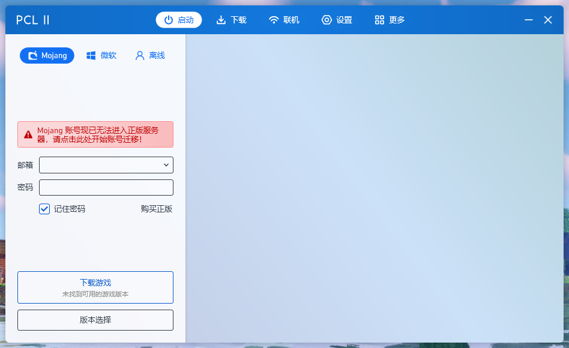
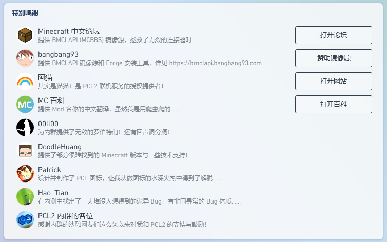

<!--此图片来自龙腾猫跃的爱发电，不占用Git存储库。-->

# Plain Craft Launcher 2 `源代码库`

`这里提供了 PCL2 的大多数源代码，包括 UI 库、动画模块、下载模块、Minecraft 启动模块等！`

<!--Badges 来自 Pull Request #192-->

## 📢 作者的话
PCL2 的代码绝大多数其实都是几年前学生时代的产物了……那时候英语还不过关……所以经常出现奇葩命名，还有令人高血压的高耦合啊，没做单例啊，瞎勾八乱糊啊之类的问题……额，我也不可能把这一堆玩意儿再从头写一次，各位就基于能跑就行的原则凑合凑合着看吧，求求别喷了（run

## 🙌 开始使用 PCL2
> PCL2 分为 `正式版` 和 `快照版`两种。 
> 你可以在 [`Releases`](https://github.com/Hex-Dragon) 页面查看每一次的更新内容。
> 
| |**正式版**|**快照版**|
|-|-|-|
|下载|[点击下载](https://afdian.net/p/0164034c016c11ebafcb52540025c377)| 请点击上方图标进入爱发电详细了解。|
|区别|相对稳定|含有最新的特性（例如联机模块），但是稳定性较差|

截图

<!--未在爱发电找到合适的截图，暂且上传一个……如果嫌慢可以在前面加“https://ghproxy.net/https://raw.githubusercontent.com/Hex-Dragon/PCL2/main/”第三方加速-->

首页

## [📖 帮助文档库](https://github.com/LTCatt/PCL2Help)
PCL2 帮助文档在 GitHub 上的存储库（是的，帮助库在另一个 Repo……）

## 🚀 协作
> 非常感谢各位小伙伴们能够来参与此项目的共同开发，您的支持是我们最大的动力。 
> 如要了解更多有关此开源仓库的消息，请参阅我们发布在爱发电的专栏 “[MC 启动器 PCL2 公开核心源代码，功能投票板块已启动！](https://afdian.net/p/dfc2bba0153e11eda98152540025c377)”。

<!--个人认为PR/Issues也属于项目的协作，因此其出现在了此处；如果认为有问题，可以在此处提交修改请求。-->

#### [🎯 提交 Issues](https://github.com/Hex-Dragon/PCL2/issues/new)
如果确认问题是 PCL2 的 Bug 所致，请打开 `Issues` 界面，选出你遇到的 Bug 类型，尽可能清晰地描述你的问题，并且附加日志文件（这个一定要上传……）
#### [🎇 提交 Pull Requests](https://github.com/Hex-Dragon/PCL2/pulls)
如果可以给予某个 Bug 或 文档中的某个错误 进行适当修改，请在此上传你的代码。
>你也可以丢 Pull Request，虽然这个源代码库并不能直接编译，但一些简单的修改应该还是没问题的……  ——龙腾猫跃

#### [🙋 PCL2 功能投票](https://github.com/Hex-Dragon/PCL2/discussions/categories/%E5%8A%9F%E8%83%BD%E6%8A%95%E7%A5%A8)
来参加投票吧，开发者会优先处理票数较高的帖子！ 
若要了解更多关于投票的信息，请阅读[关于 PCL2 功能投票](https://github.com/Hex-Dragon/PCL2/discussions/categories/2)。

## ❤️ 友情链接
- [Hello Minecraft! Launcher（HMCL）](https://hmcl.huangyuhui.net/)：huanghongxun 创作的一款非常优秀的 Minecraft 第三方启动器。
- [BakaXL](https://www.bakaxl.com)：由 TT702 开发的一款优秀的 Minecraft 第三方“崩坏”启动器。
> 接下来，我们三位启动器开发者会联手开发全新的联机模块，力求打破启动器之间的隔阂。 更多信息请见：[BakaXL / PCL2 / HMCL 对联机功能下一步发展的联合公告](https://www.bilibili.com/read/cv19553778)

---
## 🌏 一些无趣的小细节
- 别想在这里面找到解密游戏的线索，那部分的代码被我抠掉了（笑）
- 哦，对，解锁隐藏主题的相关代码也都被抠掉了，所以别想着用翻源代码这种歪门邪道来绕过解密了.jpg
- 源代码库并不是即时更新的，而是在每次 PCL2 发布更新时（手动）同步一次